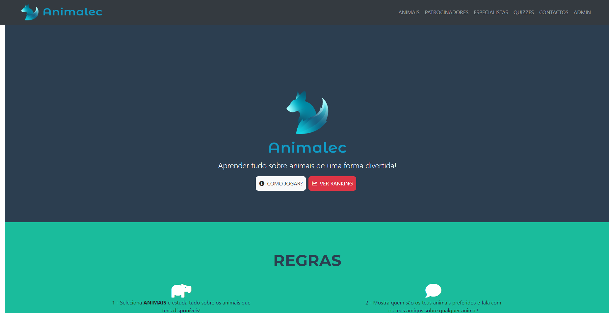
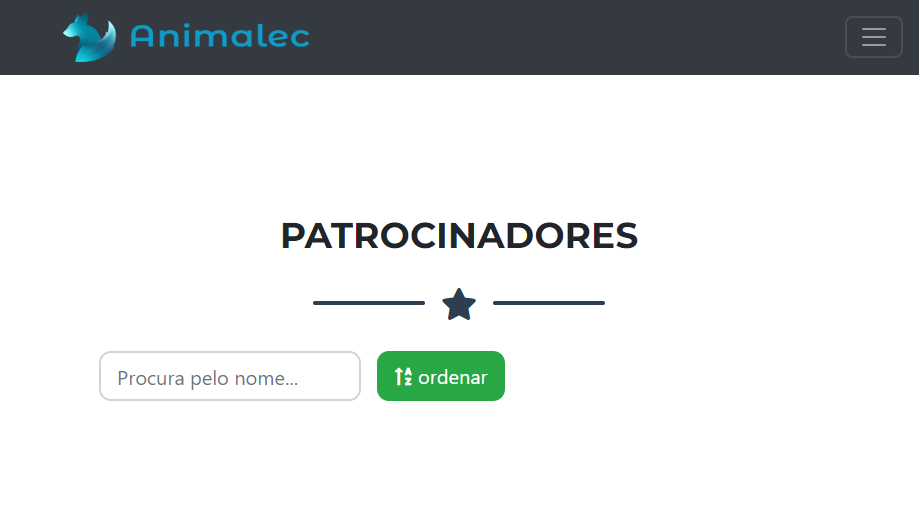
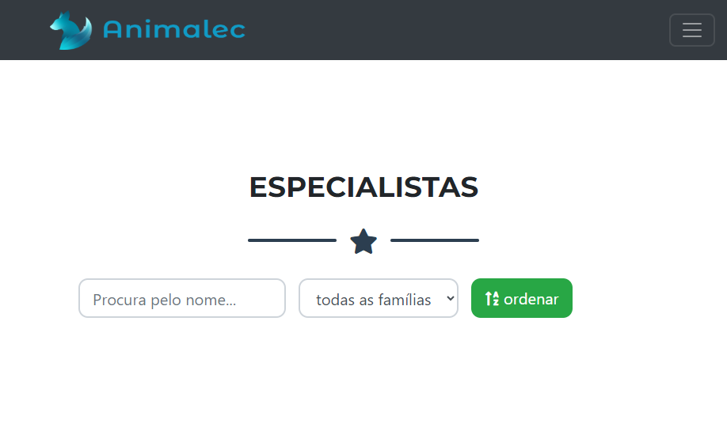
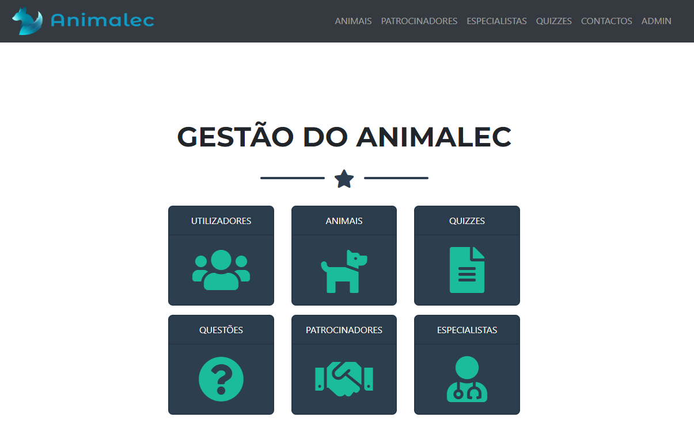
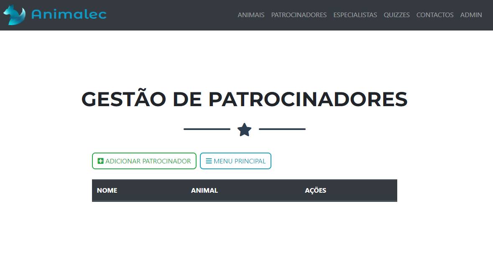
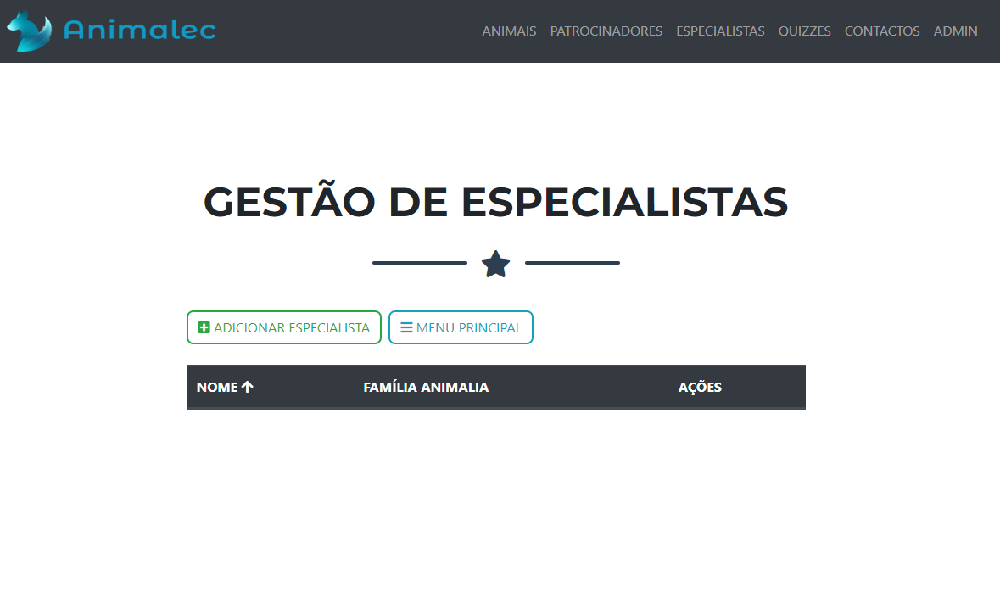
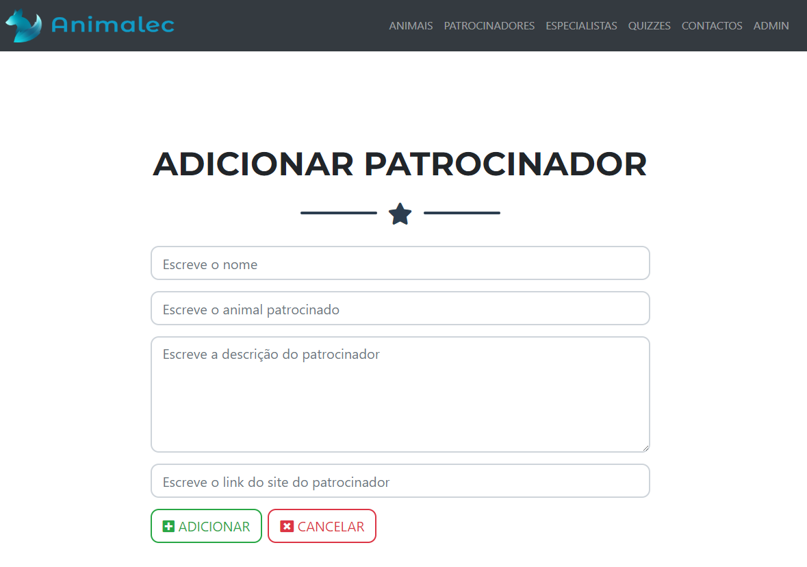
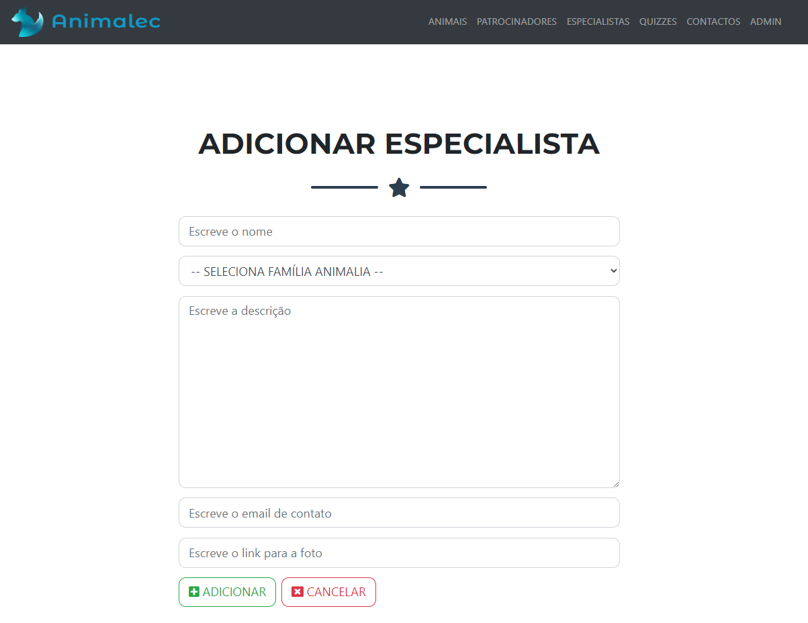

# Relatório de Alterações - Gestão de Especialistas e Patrocinadores

Este documento descreve as alterações realizadas no sistema para integrar a gestão de **Especialistas** e **Patrocinadores**, bem como o acesso público a essas entidades por utilizadores comuns.

---

## Alterações Visíveis

### 1. **Atualização do Menu de Navegação**
- O menu de navegação foi atualizado para incluir as opções de **Patrocinadores** e **Especialistas**, acessíveis apenas para utilizadores logados.
- Acesso permitido a partir da navbar por utilizadores comuns.

---

### 2. **Página de Listagem de Patrocinadores (Acesso Público)**
- Criada uma página visível a partir da navbar, onde os utilizadores podem listar todos os patrocinadores.
- Inclui filtros para buscar patrocinadores pelo nome e ordenação alfabética.

---

### 3. **Página de Listagem de Especialistas (Acesso Público)**
- Criada uma página visível a partir da navbar, onde os utilizadores podem listar todos os especialistas.
- Inclui filtros para buscar especialistas pelo nome e pela família Animalia, além de ordenação alfabética.

---

### 4. **Backoffice de Admin com as Novas Entidades**
- Adicionados dois novos itens no backoffice do administrador:
  - **Patrocinadores**
  - **Especialistas**

---

### 5. **Listagem de Patrocinadores (Admin)**
- Adicionada página na interface do administrador para listar todos os patrocinadores cadastrados.
- Inclui opções para editar e excluir patrocinadores.

---

### 6. **Listagem de Especialistas (Admin)**
- Adicionada página na interface do administrador para listar todos os especialistas cadastrados.
- Inclui opções para editar e excluir especialistas.

---

### 7. **Criação de Patrocinadores**
- Página para o administrador adicionar novos patrocinadores com os seguintes campos:
  - Nome
  - Animal patrocinado
  - Descrição
  - Link site do patrocinador

---

### 8. **Criação de Especialistas**
- Página para o administrador adicionar novos especialistas com os seguintes campos:
  - Nome
  - Família Animalia
  - Descrição
  - Email de contato
  - Link para foto/especialista

---

## Resumo Técnico das Alterações

### Componentes Vue Criados:
#### Públicos:
- **`Experts.vue`** e **`Sponsors.vue`**:
  - Listam as entidades visíveis para utilizadores comuns.
  - Incluem filtros e opções de ordenação.
- **`Expert.vue`** e **`Sponsor.vue`**:
  - Detalham informações sobre uma entidade específica.

#### Administrativos:
- **`AddExpert.vue`**, **`EditExpert.vue`**, **`ListExperts.vue`**:
  - Gerenciam as ações de criação, edição e listagem de especialistas.
- **`AddSponsor.vue`**, **`EditSponsor.vue`**, **`ListSponsors.vue`**:
  - Gerenciam as ações de criação, edição e listagem de patrocinadores.

---

### Atualização do Vuex:
- Adicionados módulos específicos para gerenciar o estado das novas entidades:
  - **`expert.module.js`** e **`sponsor.module.js`**:
    - Gerenciam as ações `FETCH`, `ADD`, `EDIT` e `REMOVE`.
  - **Constantes:** Definidas nos arquivos `expert.constants.js` e `sponsor.constants.js`.

---

### Alterações na Navegação:
- Atualização do componente de navegação para incluir **Patrocinadores** e **Especialistas** com controle de acesso para utilizadores logados.

